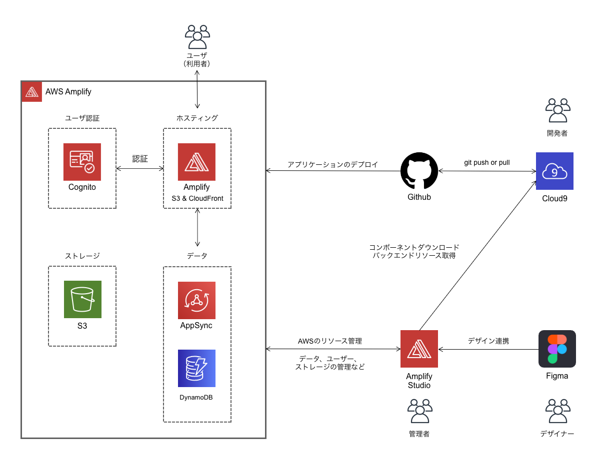

# Amplify Studio x Figma で React アプリケーションをデプロイ（ハンズオン形式）

## 概要

AWS Amplify Studio × Figma で React アプリケーションのデプロイを行います。

このハンズオンでは Amplify Studio, Figma, Cloud9, Github を利用した開発・運用フローを体験していただきます。

### 概要図

参考

https://aws.amazon.com/jp/blogs/news/aws-amplify-studio-figma-to-fullstack-react-app-with-minimal-programming/

## アジェンダ

### [1. AWS のマネージメントコンソールへログイン](./section01.md "01")

### [2. Github のリポジトリ準備](./section02.md "02")

### [3. Cloud9 の初期設定](./section03.md "03")

### [4. Figma の設定](./section04.md "04")

### [5. Amplify Studio の設定](./section05.md "05")

### [6. Cloud9 でアプリケーションの設定](./section06.md "06")

### [7. Github 連携でデプロイ](./section07.md "07")

**Next Section**

### [ユーザー認証機能の追加](./section08.md "08")

### [デザイン変更 / デプロイ（デモ）](./section09.md "09")

### [Amplify Studio でできること（説明）](./section10.md "10")

### [後片付け](./section-delete.md "delete")
