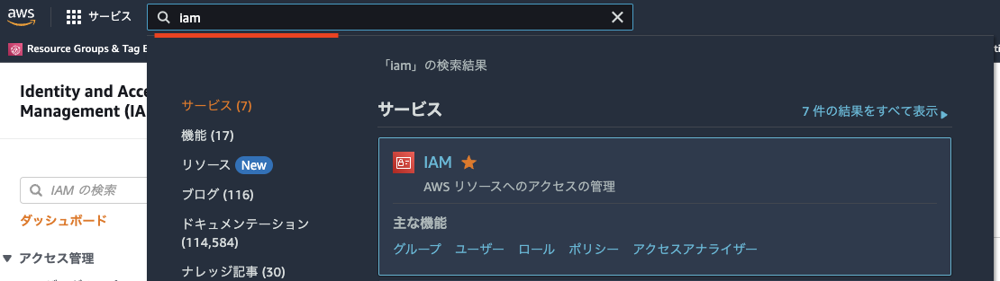
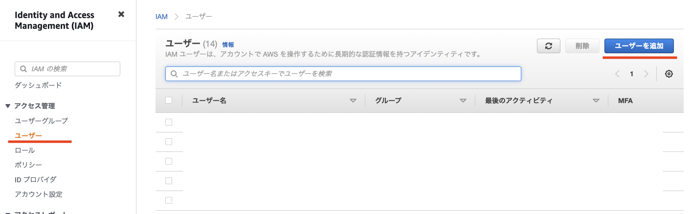
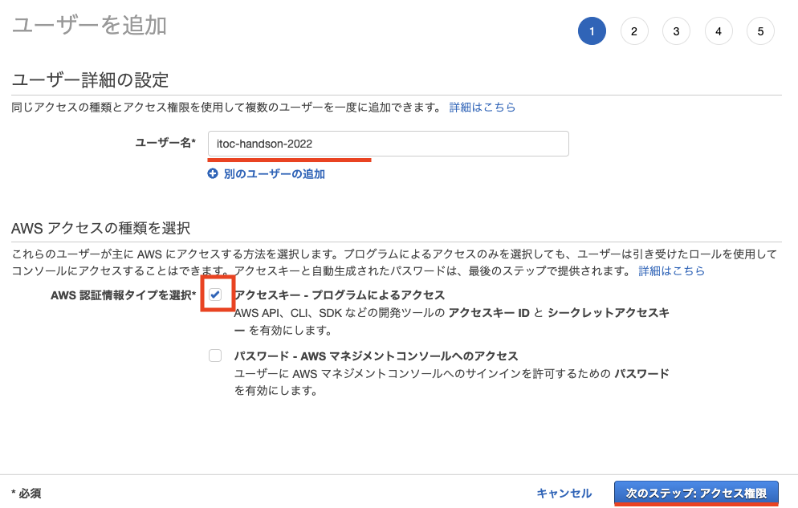
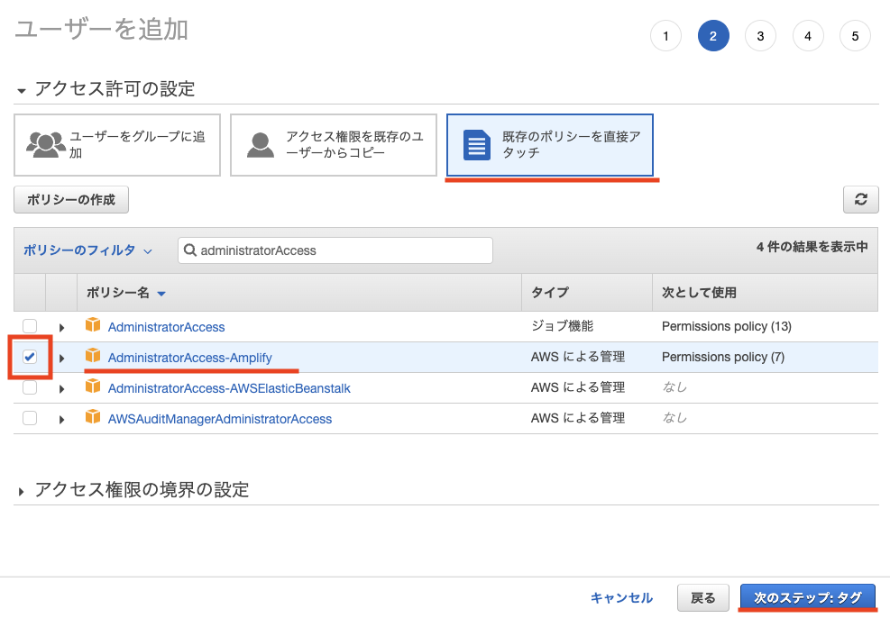
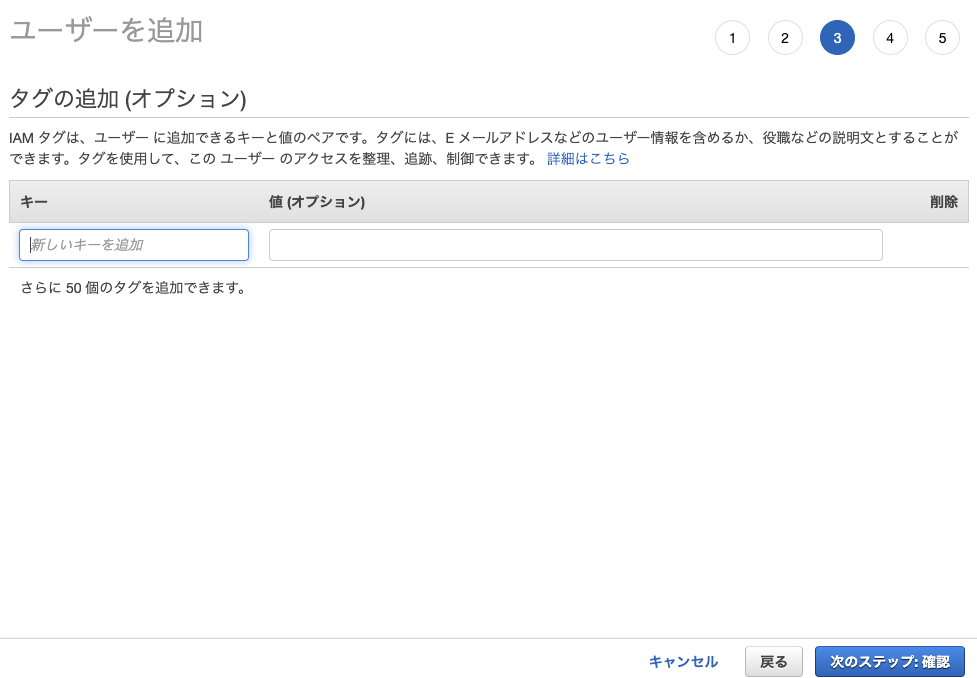
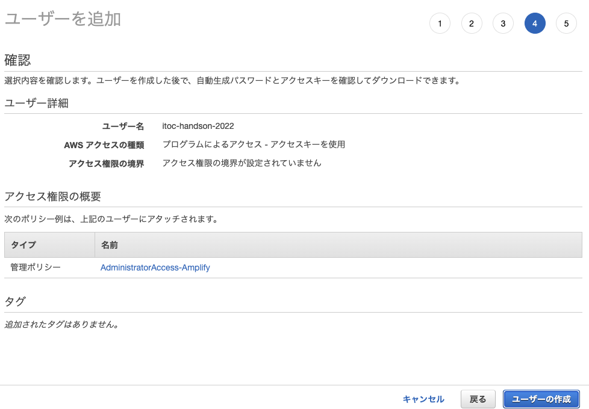
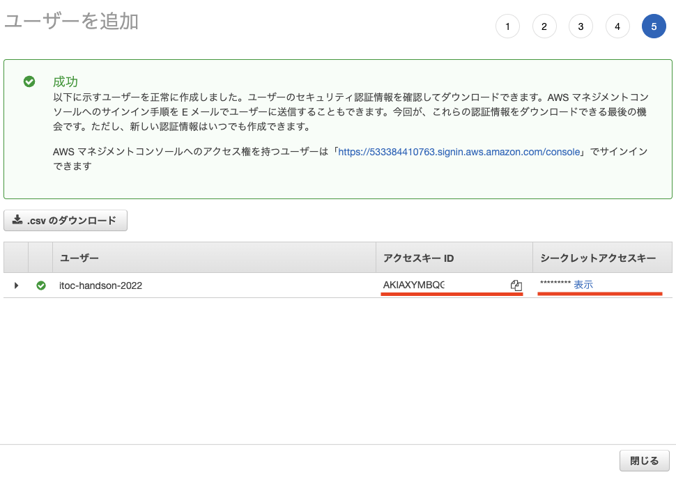

# 1. AWS のマネージメントコンソールへログイン

マネージメントコンソールへのログインの確認と aws cli で使用するユーザーを作成します。

## AWS コンソールへログイン

## IAM ユーザー作成

1. **IAM** に移動します。
1. 左上のサービス検索窓に **IAM** と入力して移動してください。

---

1. サイドメニューの「**ユーザー**」をクリックし「**ユーザー追加**」をクリックしてください。

---

1. ユーザー名を入力します。（例：**itochandson2022**）
1. 「**アクセスキー・プログラムによるアクセス**」にチェックを入れます。
1. **次のステップ**をクリックします。

---

1. 「**既存のポリシーを直接アタッチ**」を選択し、「**AdministratorAccess-Amplify**」にチェックを入れて、次のステップをクリックします。
1. 検索窓で **AdministratorAccess** など入力すると探しやすくなります。

---

1. **次のステップ**をクリックします。

---

1. **ユーザーの作成**をクリックします。

---

1. **アクセスキー ID** と**シークレットアクセスキー**をメモしておきます。  
   または CSV でダウンロードしても OK です。
1. 保存が終わったらユーザー作成は終了です。

---

[-> 2. Github のリポジトリ準備](./section02.md "02")

[-> トップへ戻る ->](./README.md "top")
