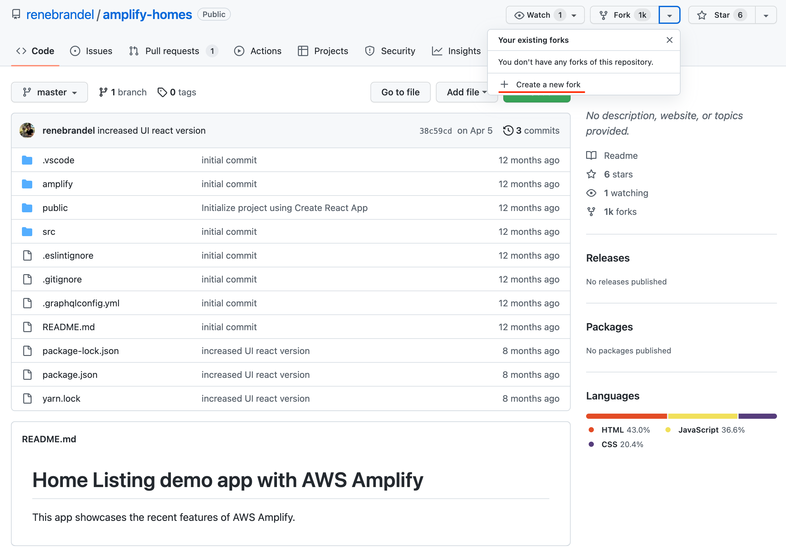

# 2. Github のリポジトリ準備

**Github** にログインしてください。

以下のリポジトリーへアクセスして、フォークをしてください。  
https://github.com/renebrandel/amplify-homes

---

1. 画面右上の「**fork**」の横のアイコンをクリックし、「**Create a new fork**」をクリックします。

---

1. **Repository name** を確認して、「**Create fork**」をクリックします。

---

[-> 3. Cloud9 の初期設定](./section03.md "03")

[-> トップへ戻る](./README.md "top")
