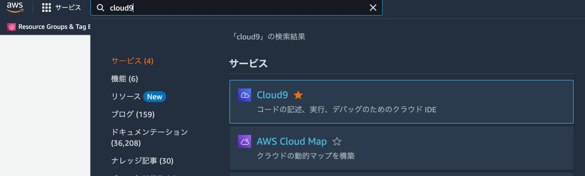
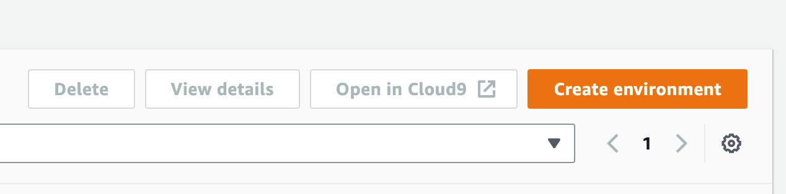
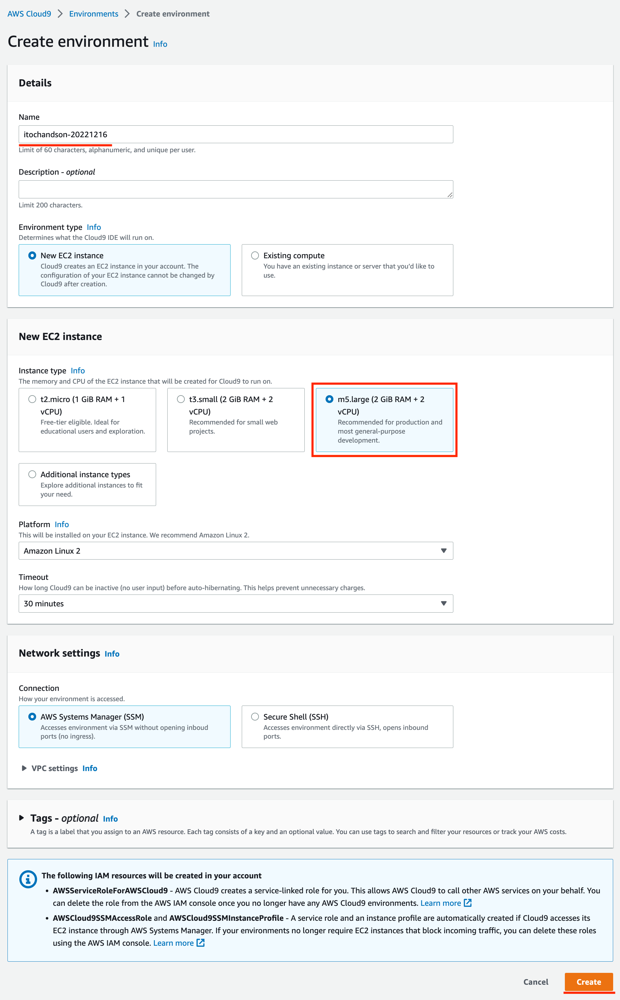
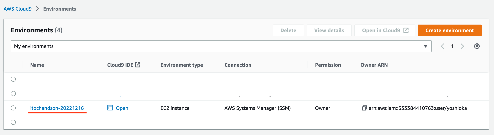
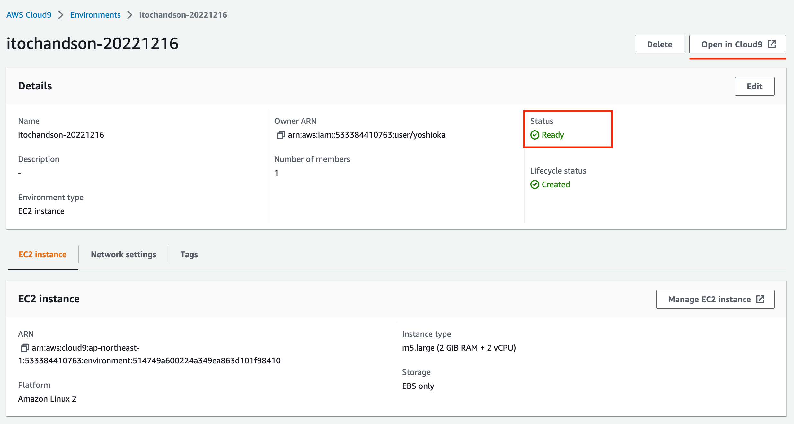
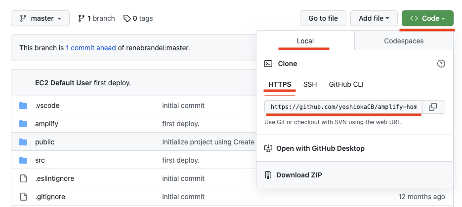

# 3. Cloud9 の初期設定

AWS のマネージメントコンソールにログインし、Cloud9 を利用した開発環境を作成します。



1. cloud9 に移動します。

---



1. 「**Create environment**」をクリックします。

---



1. **name** は 任意の文字列を入力してください。（例：**itochandson20221216**）
2. **Instance Type** は **m5.large** を選択してください。
3. 「**Create**」をクリックして作成してください。

---



1. 一覧に表示されることを確認したら、クリックして詳細を表示します。

---



1. **Status** が **<span style="color: green">Ready</span>** になっていることを確認したら「**Open in Cloud9**」をクリックして Cloud9 を起動します。
2. Cloud9 が起動したらターミナルから作業を行います。

## Cloud9 ターミナルでの作業

### Github から URL を取得



1. https の URL をコピーします。

### ソースコード取得

```bash
mkdir handson
cd handson
git clone https://github.com/xxxxxxx/amplify-homes.git
cd amplify-homes/
```

1. **git clone ...**の URL は Github でコピーした URL に置き換えてください。
1. **https** から始まっているか確認してください。（git...から始まる場合、うまく clone できません。）
1. 最後にアプリケーションルートに移動します。

### amplify cli インストール

node のバージョン確認 **16.18.1** であることを確認します。

```bash
node -v
=> v16.18.1
```

**amplify cli** をインストールします。バージョンは **9.2.1** を使用します。

```bash
npm i -g @aws-amplify/cli@9.2.1
amplify --version
=> 9.2.1
```

`package.json` に記述されているライブラリをインストールします。

```bash
npm i
```

注）`npm i` でエラーになる場合、実行場所を確認してください。（`git clone` したアプリケーションのルートにいることを確認してください。）

### Amplify のアプリケーションの初期設定

```bash
amplify init
Note: It is recommended to run this command from the root of your app directory
? Do you want to use an existing environment? No
? Enter a name for the environment dev
? Choose your default editor: None
Using default provider  awscloudformation
? Select the authentication method you want to use: AWS access keys
? accessKeyId:  ********************
? secretAccessKey:  ****************************************
? region:  ap-northeast-1
```

? Do you want to use an existing environment? <span style="color: orange"> No </span>

<span style="color: orange"> No </span> を入力

? Enter a name for the environment <span style="color: orange"> dev </span>

<span style="color: orange"> dev </span> と入力

? Choose your default editor: <span style="color: orange">None</span>

<span style="color: orange">None</span> を選択

? Select the authentication method you want to use: <span style="color: orange">AWS access keys</span>

<span style="color: orange">AWS access keys</span> を選択し、 **1. AWS のマネージメントコンソールへログイン** で作成した IAM ユーザーの**アクセスキー ID** と**シークレットアクセスキー**をそれぞれ入力してください。

? region: <span style="color: orange">ap-northeast-1</span>

<span style="color: orange">ap-northeast-1</span>を選択

入力後、しばらくすると Amplify にアプリケーションが作成されます。

---

[-> 4. Figma の設定](./section04.md "04")

[-> トップへ戻る](./README.md "top")
