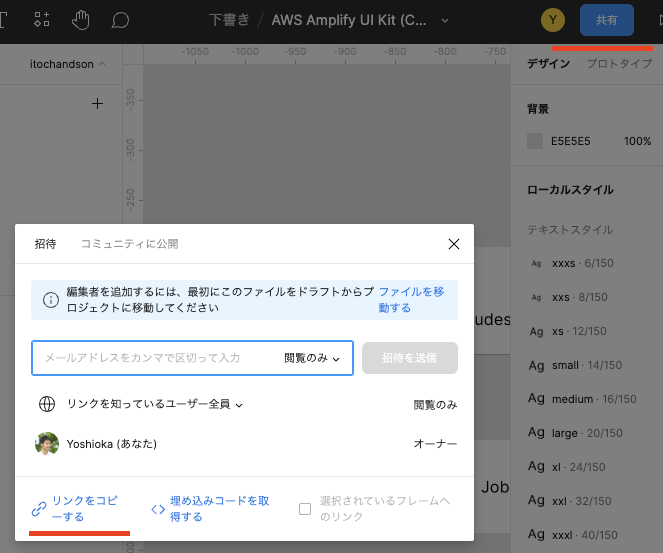

# 4. Figma の設定

Amplify Studio で使用するコンポーネントを作ります。（デザインします）
今回は「**AWS Amplify UI Kit**」を利用します。

1. まずは Figma にログインしてください。 https://www.figma.com/ja/

---

1. 画面左のメニューにある、「**コミュニティ**」をクリックします。

---

1. 検索窓に「**AWS Amplify UI Kit**」と入力し、ユーザーが「**AWS Amplify**」になっているファイルをクリックして読み込みます。  
   （複数表示されますので、ユーザーを間違えないように注意してください。）

---

1. 画面右上の「**コピーを取得する**」をクリックします。

---

※Figma のデスクトップアプリケーションをインストールしている場合はアプリを立ち上げようとしますが、「代わりにここで開く」をクリックするとブラウザで AWS Amplify UI Kit を開きます。

---

1. 画面左のメニューの「**My Component**」を選択した状態で、「**FAQItem**」、「**NavBar**」以外のコンポーネントを全て削除します。  
   （今回は「**FAQItem**」、「**NavBar**」のコンポーネントのみ使用しますので、不要なコンポーネントは削除します。）

---

1. 「**FAQItem**」のコンポーネント名を「**NewsItem**」に変更します。

---

1. 画面右上の「**共有**」をクリックし、「**リンクをコピーする**」をクリックします。

---

[-> 5. Amplify Studio の設定](./section05.md "05")

[-> トップへ戻る](./README.md "top")
