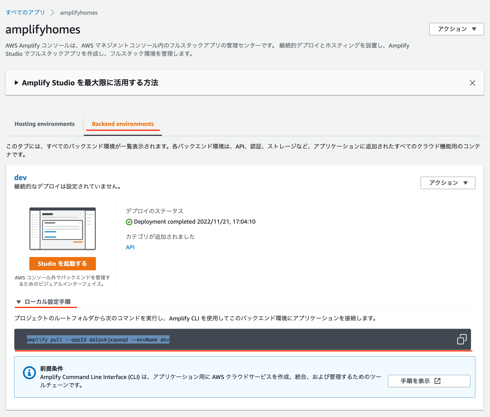
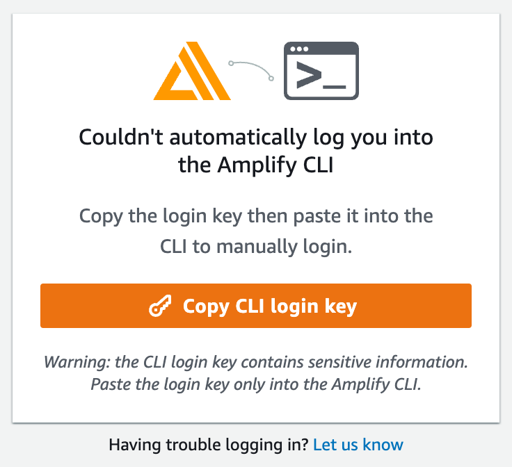
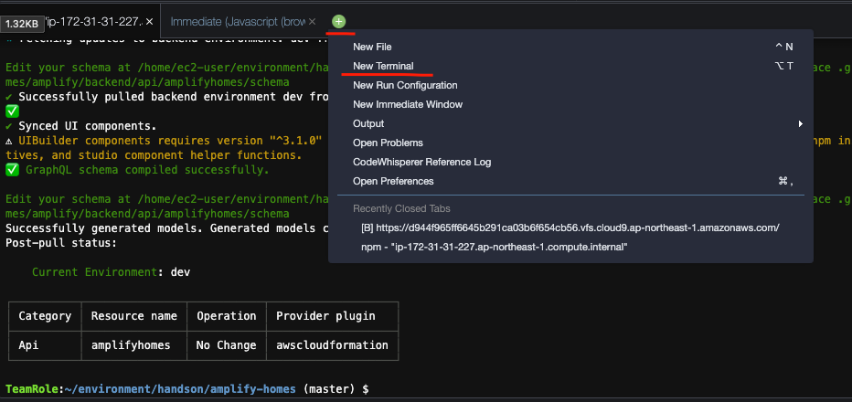

# 6. Cloud9 でアプリケーションの設定

Amplify で作成したバックエンドの設定とコンポーネントをアプリケーションにダウンロードし、動作を確認します。



- Amplify のアプリケーションの画面でローカル設定の手順に書かれているコマンドをコピーします。

```bash
amplify pull --appId ******** --envName ***
```

- コピーしたコマンドの `pull` を `configure` に置き換えてターミナルに入力し実行します。

```bash
cd ~/environment/handson/amplify-homes
amplify configure --appId ********* --envName dev
Opening link: https://ap-northeast-1.admin.amplifyapp.com/admin/***********/dev/verify/?loginVersion=1
✔ Confirm login in the browser or manually paste in your CLI login
```

- コマンドを実行すると URL が表示れますので、**URL をクリック** **OPEN をクリック**し認証画面を表示します。  
   （Opening link: https://ap-northeast-1.admin.amplifyapp.com/admin/***********/dev/verify/?loginVersion=1）



- 「**Copy CLI login key**」をクリックし、**key をコピー**したら、ターミナルに戻り、貼り付けます。

```
✔ Successfully received Amplify Studio tokens.
```

- 認証が終わったら `amplify pull` で Amplify で作成したデータを取得します。

```
amplify pull
```

- 途中 ? **Are you sure you would like to continue?** と聞かれますが <span style="color: orange"> Yes </span>と入力してください。

```
? Are you sure you would like to continue? Yes
```

- データーの読み込みが終わったら、`./src/App.js` を以下のコードに置き換えます。

```javascript
import "./App.css";
import { NavBar, NewsItemCollection } from "./ui-components";

function App() {
  return (
    <div className="App" style={{width: "100%", padding: '20px'}}>
      <NavBar width={"100%"} />
      <NewsItemCollection width={"100%"} />
    </div>
  );
}

export default App;
```

## ターミナルからサーバーを起動し、動作確認をします。

### Cloud9 ローカルサーバー起動

- Cloud9ターミナルタブの横にある「**+**」ボタンで「**New Terminal**」を選択し、新しいターミナルを開きます。



- 新しいTerminalで、ローカルサーバを起動します。

```bash
cd ~/environment/handson/amplify-homes
PORT=8080 npm start
```

- 次のような出力がされた後、プレビューを確認することができるようになります。

```
Compiled successfully!

You can now view amplify-homes in the browser.

  Local:            http://localhost:8080
  On Your Network:  http://xxx.xxx.xxx.xxx:8080

Note that the development build is not optimized.
To create a production build, use yarn build.
```

- 画面上部の「**Preview**」をクリックし「**Preview Running Application**」をクリックして、アプリケーションにアクセスします。


---

[-> 7. Github 連携でデプロイ](./section07.md "07")

[-> トップへ戻る](./README.md "top")
