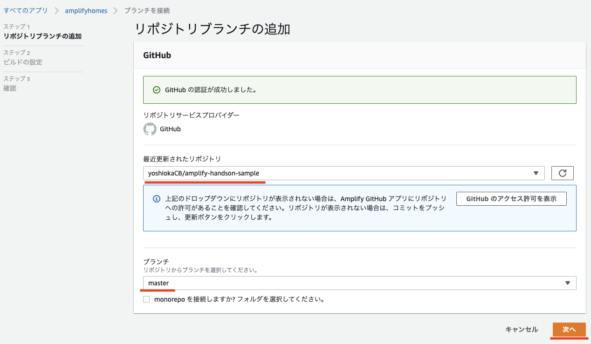
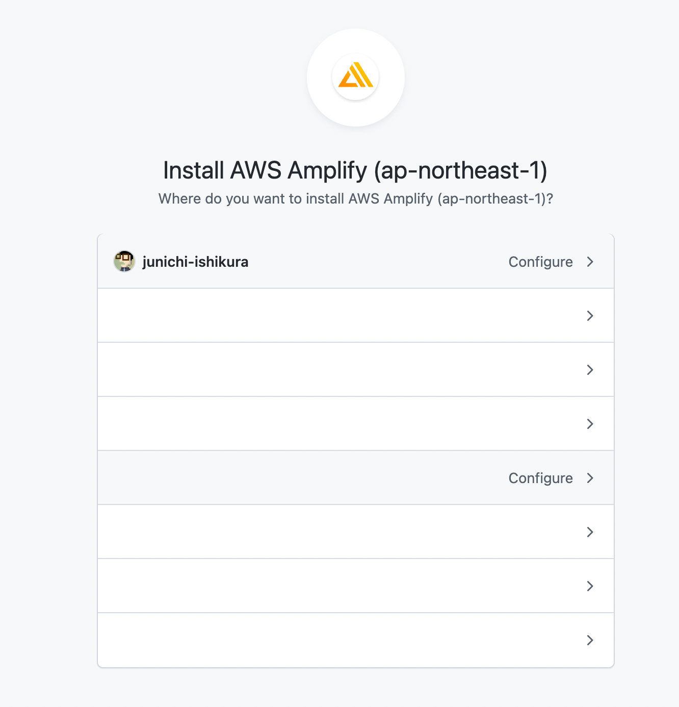

# 7. Github 連携でデプロイ

最後に Github と連携する設定を行い、リポジトリが更新されるタイミングでデプロイできるように設定をします。

## Cloud9 での作業

`npm start`を実行していない Cloud9 のターミナルで、これまでの修正をコミットして Github にプッシュします。

```bash
git add .
git commit -m 'first deploy.'
git push origin master
```

git push origin master で次のように認証を要求された場合はGitHubのユーザー名とGitHubのパーソナルアクセストークンを入力します。
パーソナルアクセストークンが分からない場合、 https://docs.github.com/ja/authentication/keeping-your-account-and-data-secure/creating-a-personal-access-token の手順を元にトークンを生成してください。

パーソナルアクセストークンを新たに作成する場合、以下の内いずれかを実行してください。

- **Fine-grained tokens**を作成する場合、**Repository access**で「**amplify-homes**」を選択し、**Repository permissions**で、「**Contents**」の「**Read and write**」を許可してください。
- **Personal access tokens (classic)** を作成する場合、**Select scopes**で「**repo**」の「**Full control of private repositories**」にチェックを入れてください。


```
Username for 'https://github.com/xxxxxxxx/amplify-homes.git': <ユーザー名>
Password for 'https://xxxxxxxx@github.com/xxxxxxxx/amplify-homes.git': <パーソナルアクセストークン>
```

## AWS Amplify （マネージメントコンソール）での作業

AWS マネージメントコンソールの Amplify にアクセスし Gthub 連携の設定をします。


1. 作成したアプリケーションを選択します。
1. 「**Hosting environments**」のタブをクリックし、「**Github**」を選択し、「**ブランチ接続**」をクリックします。

---


1. 「**Authrize AWS Amplify (xxx)**」をクリックして AWS Amplify と Github を接続を許可します。

---



1. リポジトリを選択してください（例：**amplify-homes**）
1. **master** ブランチを選択してください。
1. 次へをクリックします。

---


※ドロップダウンにリポジトリが表示されない場合は、「**Github のアクセス許可を表示**」をクリックします。

---



※自身の Github アカウントを選択して Amplify Github アプリをインストールします。

---


1. 「**新しいロールを作成**」をクリックし、デプロイに使用するロールを作成します。

---

## ロールの作成


1. **AWS サービス**、**Amplify**、**Amplify - Backend Deployment** が選択させていることを確認し、「**次のステップ：アクセス権限**」をクリックします。  
   ※ アクセスした時点で選択された状態になっています。

---


1. **AdministoratorAccess-Amplify** が選択されていることを確認し、「次のステップ」をクリックします。
   ※ アクセスした時点で選択された状態になっています。

---


1. 「**次のステップ**」をクリックします。

---


1. ロール名が入力されていることを確認し、「**ロールの作成**」をクリックします。

---


1. **app name** は **xxx(this app)** になっていること、**Environment** が **dev** になっていることを確認し、先ほど作成したロールを選択し、「**次へ**」をクリックします。

---


1. 「**保存してデプロイ**」をクリックします。

---


1. デプロイが開始されます。
1. デプロイ完了後、発行された URL にアクセスするとアプリケーションの確認ができます。

---

[-> 8. extra](./section08.md "08")

[-> トップへ戻る](./README.md "top")
