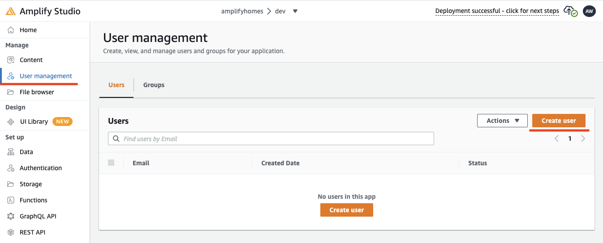
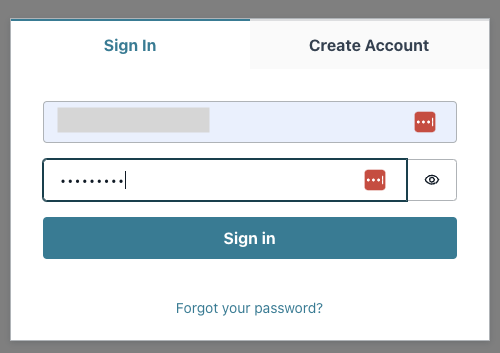

# ユーザー認証機能の追加

## Amplify Studio での作業

### Authentication の Deploy


1. 画面左のメニューの **Authentication** をクリックします。
1. 設定はデフォルトのまま **Deploy** をクリックします。

---


1. **Comfirm deployment** をクリックします。

---

### User 登録



1. 画面左のメニューの **User management** をクリックします。
1. **Create user** をクリックしてユーザーの新規登録します。

---


1. **email address**, **password** を入力して、**Create user** をクリックします。

---


1. 登録されたことを確認します。

---

## Cloud9 での作業

### バックエンドの設定情報の取得

1. `amplify pull` を実行して **Authentication** の設定情報をコードに反映させます。
2. 実行後、**Auth** が追加されたことを確認します。

```bash
amplify pull

┌──────────┬───────────────┬───────────┬───────────────────┐
│ Category │ Resource name │ Operation │ Provider plugin   │
├──────────┼───────────────┼───────────┼───────────────────┤
│ Api      │ amplifyhomes  │ No Change │ awscloudformation │
├──────────┼───────────────┼───────────┼───────────────────┤
│ Auth     │ amplifyhomes  │ No Change │ awscloudformation │
└──────────┴───────────────┴───────────┴───────────────────┘

```

### コード修正

1. `app.js` のコードを修正します。

```javascript
import "./App.css";
import { NavBar, NewsItemCollection } from "./ui-components";
import { withAuthenticator } from '@aws-amplify/ui-react';
import '@aws-amplify/ui-react/styles.css';

function App() {
  return (
    <div className="App" style={{width: "100%", padding: '20px'}}>
      <NavBar width={"100%"} />
      <NewsItemCollection width={"100%"} />
    </div>
  );
}
export default withAuthenticator(App);
```

### 動作検証

1. ターミナルにコマンド入力しサーバーを起動します

```bash
PORT=8080 npm start
```


1. 起動後、**Preview** を使用してブラウザからアクセスします。

---



1. ログイン画面が表示されることを確認します。
1. Amplify Studio で作成した **email address** と **password** を入力してログインします。

---


1. パスワード変更を要求されるので新しいパスワードを入力します。
1. 変更完了後、アプリケーションが表示されれば OK です。

---

[-> トップへ戻る](./README.md "top")
