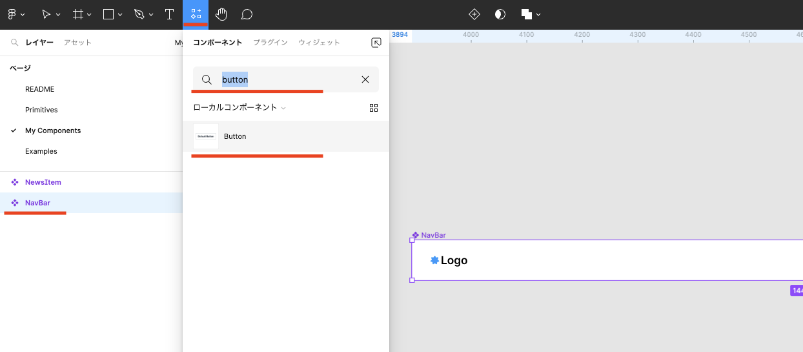
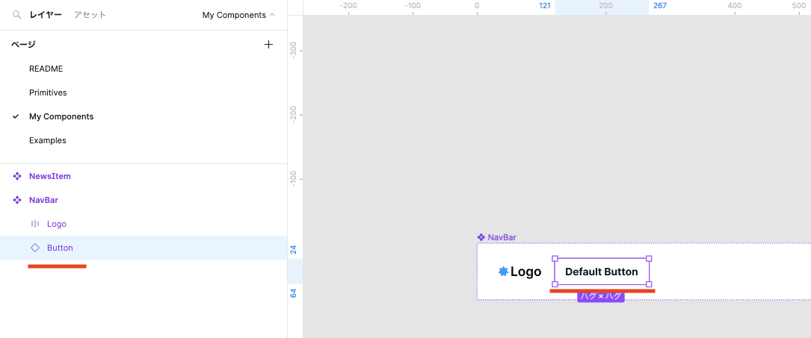
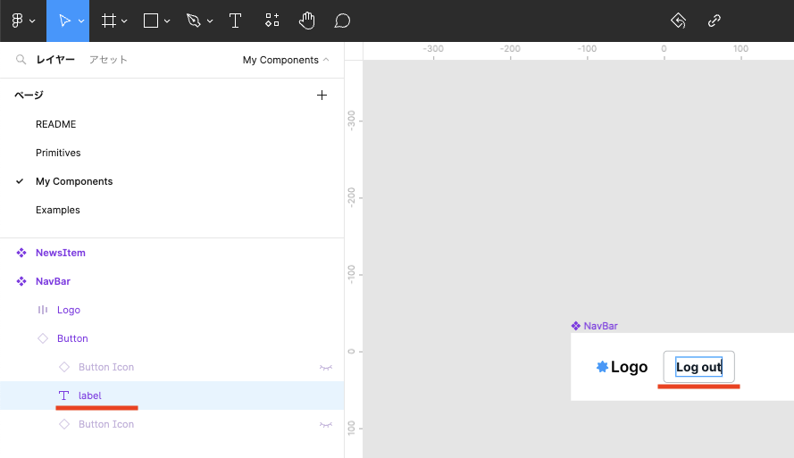
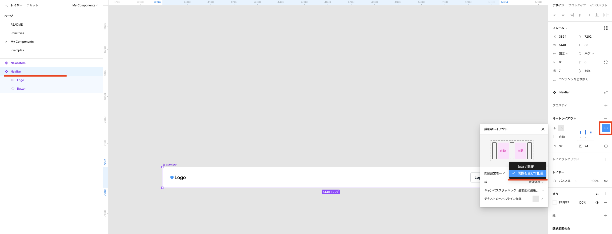
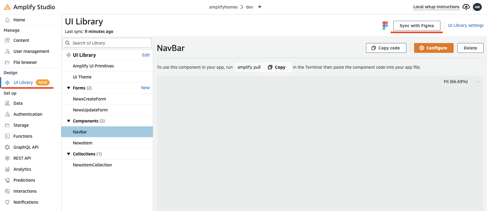
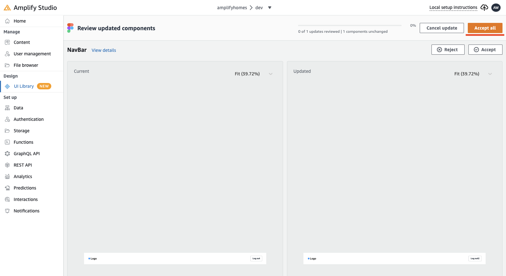
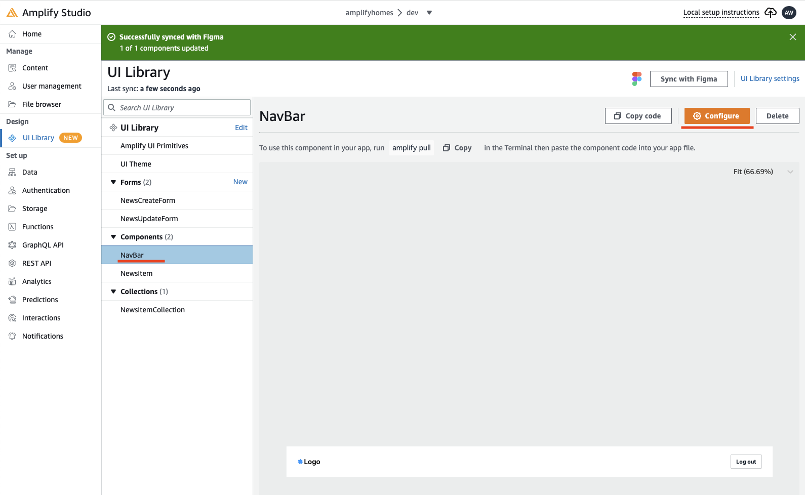
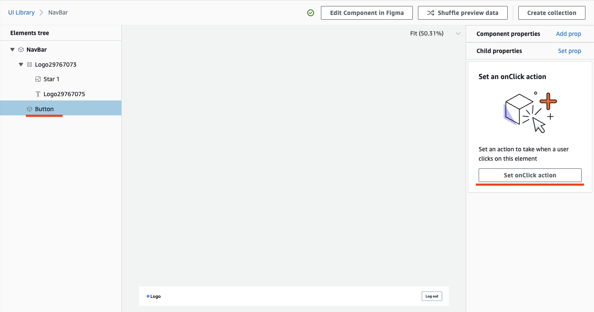
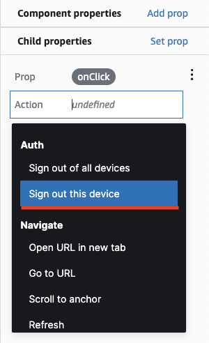
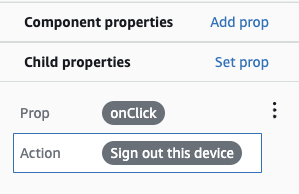

# デザイン変更 / デプロイ

## Figma での作業

### ヘッダーのコンポーネントの編集



1. **NavBar** が選択された状態にします。
1. **Logo** 以外のインスタンスを全て削除します。
1. 画面上部のメニューの「**リソース**」アイコンをクリックします。
1. 検索窓に **button** と入力し、ローカルコンポーネントの **Button** クリックいます。

---



1. 画像のように 「**Default button（Button）**」が追加されたのを確認します。

---



1. **label** が選択された状態からテキストを「**Default button**」から「**Log out**」に修正します。

---



1. **NavBar** が選択された状態にします。
1. 右メニューのオートレイアウトの詳細の設定ボタン（...）をクリックします。
1. 「**間隔設定モード**」の設定で「**空間を開けて配置**」を選択します。
1. 「**Log out（Button）**」の配置が変わったことを確認します。）

---

## Amplify Studio での作業

### デザインの更新



1. 左メニューの **UI Library** をクリックし、続けて画面右上の「**Sync with Figma**」をクリックします。

---



1. 画面右上の **Accept all** をクリックします。

---



1. 画面左の **Navbar** が選択されていることを確認し、「**Configure**」をクリックします。

---

### ログアウトボタンの設定



1. 画面左の **tree** を展開し、**Button** をクリックします。
1. 続けて画面右のメニューの **Set onClick action** をクリックします。

---



1. Action は 「**Sign out this device**」を選択します。

---



1. 画像のように表示されていれば OK です。

---

## Cloud9 での作業

### 修正したコンポーネントのダウンロード

```bash
amplify pull
```

### 動作確認

```bash
PORT=8080 npm start
```

### デプロイ

```bash
git add -u
git commit -m 'update components.'
git push origin master
```

---

[-> トップへ戻る](./README.md "top")
